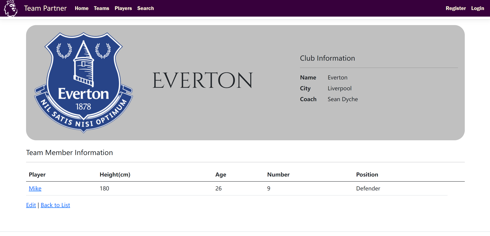
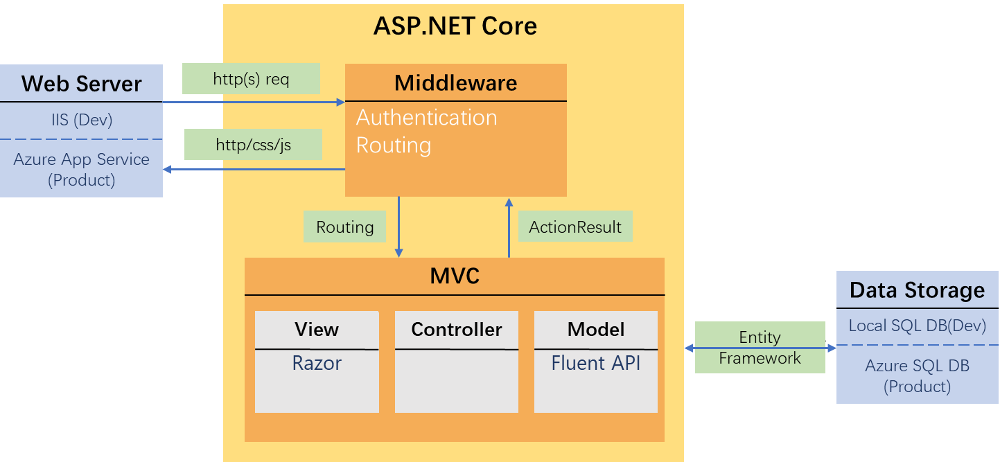

#  Team Partner Web App 
## Introduction:
This is an assignment of **SWEN504 Individual Project.**   
The objective of this project is to develop an official-like website for a football league, where users can browse information about the league's matches, standings and news. Administrators can also manage club and player profiles after login and creating, reading, updating and deleting.  
This app is deployed on Azure App Service and data is stored on Azure SQL DB
[Visit the web app on Azure](https://teamwebapp20240112194902.azurewebsites.net/)  
>**Login Info**  
It requests signing in to perform deleting, editing, updating operation, you can use the existing administrator account:  
User: jinanmeng@team.com  
Password: teamAdmin_2024  
Or you can create a new one (no actual email verification is required so a fake email address works)

## Snapshoot
home page

team details

## Features
- register/ login/ logout
- dynamic home page
- create/read/update/delete the details of Teams/ Players
- upload image for Teams/ Players 
- search
- input data validation
- object oriented database

## Building Blocks

## Tech Stack 
| Type | Name |
| ----------- | ----------- |
| Framework  | ASP.NET Core 8.0 |
| Back End   | C# |
| Front End  | HTML/JavaScript/CSS |
| Database   | sqlServer |
| Web Server | IIS |
| Object-Relational Mapper | Entity Framework Core |
| Architectural Design Pattern|  MVC (Model-View-Controller) |
| Markup Syntax | Razor |

## Used Tools/Platforms
1.	CSS/DOM Analyzing: Chrome dev tool
2.	API Testing: Postman
3.	Repository: GitHub
4.	Cloud: Azure app service, Azure SQL Database
5.	Web Font: Google Fonts

## Installation
### Steps: ###   
To run the source code in your local machine, please follow the steps below:
1. Download (or pull) the repository from the github :   
https://github.com/Edmond-J/TeamPartnerWebApp
2. Configure the database (two options):
>- Option 1: download the .mdf, and .ldf files from the link below and move them to your C:/User/YourUserName :  
https://drive.google.com/drive/folders/1YtRDedi-jy88hr14BPlDM27kdw_WqXz2?usp=sharing
>- Option 2: open the “appsettings.json” file in the root directory, comment out the existing statement of the DefaultConnection, and active the second line, as shown below:   
By doing this, you will use the cloud database in Azure

## License
MIT